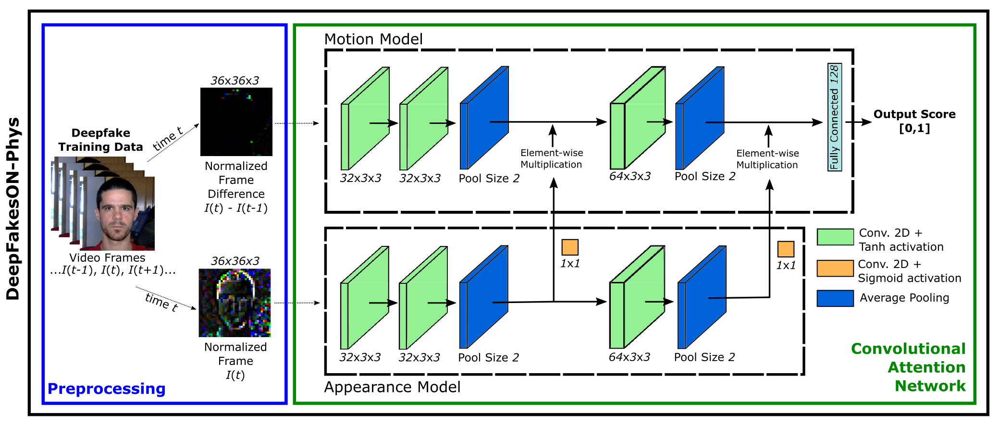
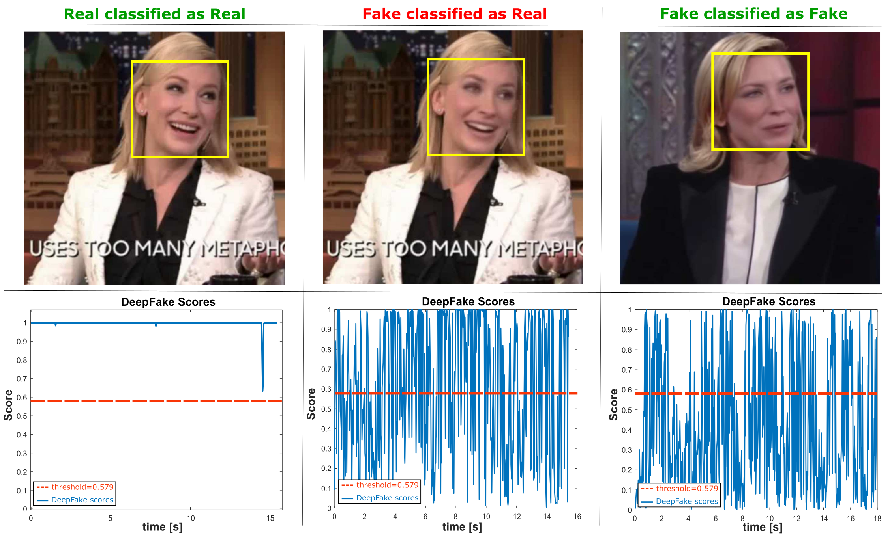

# DeepFakesON-Phys: DeepFakes Detection based on Heart Rate Estimation



This repository is clone from the original [DeepFakesON-Phys](https://github.com/BiDAlab/DeepFakesON-Phys)

Most of the original README file is kept as it is. The main changes are to make the installation process easier and to make the code more readable.

**Note**: The pretrained models only work with CUDA compatible GPUs. If you want to use the models with a CPU, you will need to retrain the models with the CPU (which is not in the scope of this repository).

## Overview
DeepFakesON-Phys is DeepFake detection framework based on physiological measurement. In particular, it considers
information related to the heart rate using remote photoplethysmography (rPPG). 
DeepFakesON-Phys uses a Convolutional Attention Network (CAN), which extracts spatial and temporal information from video frames, analyzing and combining both sources to better detect fake videos. 

DeepFakesONPhys has been experimentally evaluated using the latest public databases in the field: Celeb-DF and DFDC. The results
achieved, above 98% AUC (Area Under the Curve) on both databases, outperform the state of the art and prove the success of fake detectors based on physiological measurement to detect the latest DeepFake videos.

For further detail you can consult [our paper](https://arxiv.org/pdf/2010.00400.pdf).



## Access

### Configuring environment in Windows:

1. Create a new environment:

    ```bash
    conda create -n [env-name]
    ```

    Or:

    ```bash
    pip install virtualenv
    virtualenv [env-name]
    ```

2. Activate the environment:

    ```bash
    conda activate [env-name]
    ```

    Or:

    ```bash
    [env-name]\Scripts\activate # Windows
    source [env-name]/Scripts/activate # Linux
    
    ```

3. Install the dependencies:

    ```bash
    pip install -r requirements.txt
    ```

### Configuring environment in Linux:

1.1 Installing Conda: https://conda.io/projects/conda/en/latest/user-guide/install/windows.html

  Update Conda in the default environment:
    
    conda update conda
    conda upgrade --all
    

  Create a new environment:

    conda create -n [env-name]

  Activate the environment:

    conda activate [env-name]

  1.2 Alternatively, you can use the `virtualenv` package to spin up a virtual environment:

    pip install virtualenv
    virtualenv [env-name]

  
  - Linux:

    ```bash
    source [env-name]/Scripts/activate
    ```

  - Windows:
  
      ```bash
      [env-name]\Scripts\activate
      ```

2) Installing dependencies in your environment:

  Install Tensorflow and all its dependencies: 
    
    pip install tensorflow

  Install OpenCV:

    conda install -c conda-forge opencv

  Or:

    pip install opencv-python
  
3) If you want to use a CUDA compatible GPU for faster predictions you will need CUDA and the Nvidia drivers installed in your computer: https://docs.nvidia.com/deeplearning/sdk/cudnn-install/
 
   
### Using DeepFakesON-Phys for predicting scores:

  1) Download or clone the repository. 
  
  2) You have to run the vid_to_deepframes_rawframes.py script : it preprocesses the video sequences to obtain the raw normalized frames and the difference frames to feed DeepFakesON-Phys. 
    - Change the `image_path` variable to the path of the video you want to process (in .avi format), we have not tested other formats.
        
  3) Run the DeepFakesON-Phys_extract_preditions.py script: it makes inference with the processed input and returns a fake/genuine score for each frame in the video and saves them in the scores.txt file. You can combine the individual scores as you wish, e.g., by temporal windows, using some kind of temporal integration, etc.
    - Change the ``image_path`` and ``model_path`` variables to the path of the video you want to process and the path of the model you want to use.
  


## Citation
```
@article{hernandez2020deepfakeson,
  title={DeepFakesON-Phys: DeepFakes Detection based on Heart Rate Estimation},
  author={Hernandez-Ortega, Javier and Tolosana, Ruben and Fierrez, Julian and Morales, Aythami},
  journal={arXiv preprint arXiv:2010.00400},
  year={2020}
}

```
## Contact
If you have any questions, please contact [javier.hernandezo@uam.es](javier.hernandezo@uam.es), or [ruben.tolosana@uam.es](ruben.tolosana@uam.es)

## Changelog
06.11.2020: Initial release of DeepFakesON-Phys

